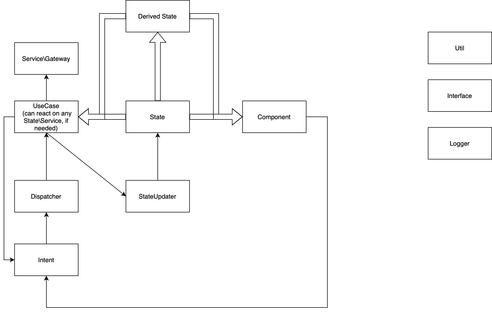

# Concept
This is an example of "clean architecture", which can be used across frontend projects of any size and technologies.  
This repository is an implementation and example of the idea, so everything from FRP to view libraries are just implementation details.  
I'm quite familiar with React and FRP, that's why my example is built on top of these technologies, but you can use anything as long as you follow this:

# Diagram

[](https://drive.google.com/file/d/1H87X78EfpOGstN7St-Y4Ytgk-UokJ08M/view?usp=sharing)

# State
State can be a stream or group of streams.   
StateUpdaters are dumb store updaters.  
StateUpdaters should work only with their own Cell.  
Selectors are optional, you might not need them because you just use streams which you need.  
Selectors should be part of State.  
ComputedState (DerivedState) can be a stateStream without stateUpdater, or function which will return parametrized stream.  
ComputedState should be simple, otherwise create useCase -> state pipeline.  

# Dispatcher
Dispatcher provides dispatch method for intents.  
Dispatcher can be a stream of intents for useCases.  

# Intents
Intents are dispatching events to Dispatcher.  
They are the only way to update useCases and can be used in top layer of application (in Components, Services, Router and etc).  
Intents only update related useCases.  
One UseCase can has only one Intent.  

# UseCases
UseCases are streams, which might be subscribed to Dispatcher.  
UseCases can be reactive for anything provided in SideEffects (e.g. reaction on state change without dispatcher).  
UseCases can dispatch action or use SideEffects.  
UseCases should contain just business logic.  
UseCases should know nothing about outer scope, but contracts.  
UseCases can invoke intents, but try to keep it inside one domain of useCases.  
If you want to use libraries like validation, ajax and so on inside useCases, use, but treat them as contracts then.  


# Components
Components can only use intents to interact with outer scope.  
Outer knowledge should only come from state or computedState streams.  
Local state is appreciated, if it's related to view.  
Components can be from any library, I will use React, but it's an implementation detail.  
Reusable components should be in components folder, routes in routes folder.  

# Gateways, services and etc
Should only be invoked in useCases as SideEffects.  
Can use Intents to invoke useCases.  

# Utils
Pure functions, which can be grouped and used across the project.  

# To run app
```npm i ```  
```npm run dev```

# TODO:  
Create a real simple app (form, filtering, complex state)  
Add tests (ava + jest? e2e?), see how they should work with useCases and components.  
Add hydration of state example.  
Add time travel example.  
Add computed state example.  
Add cancelable useCases.  
Create more complex app, maybe just develop a list of howtos.  
